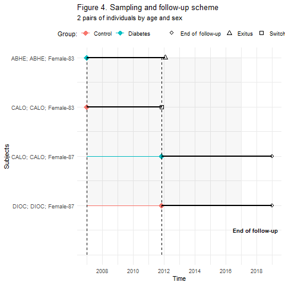

```{r setup, include=FALSE}
library(flexdashboard)
library(dplyr)
library(ggplot2)
library(kableExtra)

```


```{r lectura_dades}
# taula_models<-readRDS("codi/resultats/taula_models.Rds")
# taula_models<-readRDS("../resultats/taula_models.Rds")

# source("../funcions_TBC.R")
# load("output.RData")
source("../funcions_TBC.R")
load("output.RData")


# list.files()

# load("dades_shiny_flex.Rdata")
# dades<-readRDS("dades_compres.Rds")


```


Column {.sidebar data-width=300}
==========================

#### *Suplementary material*

<br/>


[](https://www.idiapjgol.org)


<br/>


### A cohort study in an inner district with high incidence of tuberculosis in Barcelona


<br/><br/><br/><br/><br/><br/><br/><br/><br/><br/><br/><br/><br/><br/><br/><br/><br/><br/>

The source code is available at [github/jrealgatius](https://github.com/jrealgatius/TBC_ANALISIS)

by [Jordi Real](https://jrealgatius.github.io/CV/JReal_CV.html) & [Ray Puig](https://orcid.org/0000-0002-7536-2976)


jreal@idiapjgol.info 


Sampling and follow-up sheeme {data-width=600}
================================

#### Sampling

The sampling method used was density sampling. 
This plot shown a time scheme of the recruitment of cases with an example of 5 pairs of cases. Incident Diabetes cases were selected as they occurred and their respective controls of the same sex, age on inclusion date.

A case is a person who is recorded as diabetes at index date. A control is a person who has not yet have diabetes at the index date of the case. The index date of the case can also be the onset of a disease (Diabetes), in which case controls are persons who do not yet have the disease (are not yet exposed). 


 

```{r}

```

#### Follow-up

Once identified, they are followed until the end of follow-up. Which determines your time at risk (Black line).
The follow-up was until 12/31/2018, until death or until switch group


 

#### Switch group

Example of change of group

 

---

 


Flow-Chart
====================================

#### Flow-Chart

Flow chart of how the sample finally analyzed has been arrived at.
Initially we started from a potential population from Barcelona of 85,919, of which 10,065 Diabetics (Prevalent as incidents) + 75,854 potential controls. Of these, 8004 diabetics and 8004 controls of the same age and sex were matched.


```{r}


```


 


Incidence {data-width=600}
======================================


#### Incidence rates

During the follow-up, we collected data on Tuberculosis event recorded. 

Number of subjects, tuberculosis events, and incidence rate (per 100.000 persons-year) and confidence interval (95%CI), Overall, by groups and type of diabetes during the follow-up


```{r}

taula_incidencies %>% transmute(Group,"Subjects (N)"=Patients,"Persons-years"=round(PYears,0),"Tuberculosis events"=N.Events, 'Incidence rate'=round(rate,1),
                                '(95% CI)'=paste0("(",round(IC95_Linf,1),";",round(IC95_Lsup,1),")")) %>% 
  kable(digits = 2,caption = "",align = "c") %>% 
  kableExtra::kable_styling()

#  

```

#### Cumulative incidence curve by group 


```{r}

figure1_survival

# gridExtra::grid.arrange("dfafa",figure1_survival,kable(taula_incidencies))


```


Sensitivity analysis {data-width=600}
=================================

#### Sensitivity analysis


Additional analyses in order to check the robustness of the results include the different approach models \n

```{r}
forest_figura + expand_limits(y=c(0.10,350))+ 
  theme(legend.text = element_text(size=8),
        legend.key.size = unit(0.2, "cm"))


taula_models %>% 
  transmute(Model=stringr::str_remove(Model,"Model"),'Adjust variables'=adjustedby) %>% 
  filter(Model!="Unadjust") %>% 
  head(4) %>% 
  knitr::kable(caption="Model specifications") %>% 
  kableExtra::kable_styling()


#  


```

##### Methods

**Competing risk**: Competing Risks Regression for Clustered Data. Regression modeling of subdistribution hazards for clustered right censored data. Failure times within the same cluster are dependent. crrs R package Vesion 1.1.
This method extends Fine-Gray proportional hazards model for subdistribution (1999) to accommodate situations where the failure times within a cluster might be correlated since the study subjects from the same cluster share common factors This model directly assesses the effect of covariates on the subdistribution of a particular type of failure in a competing risks setting.

Bingqing Zhou and Aurelien Latouche (2013). crrSC: Competing risks regression for Stratified and Clustered data. R package
version 1.1. https://CRAN.R-project.org/package=crrSC

**Cox PH by clusters**: Fits a Cox proportional hazards regression model with clusters. coxph function from {survival} R packages
Therneau T (2015). _A Package for Survival Analysis in S_. version 2.38, <URL: https://CRAN.R-project.org/package=survival>.


```{r}

```


Full model {data-width=600}
=================================

#### Full model


```{r,fig.width=7,fig.height=5}

forest_model_figura + labs(caption="Model adjusted by Competing Risks Regression for Clustered Data")

# forest_model2_figura

# forest.plot.modelcomplet(dadesmodelcomplet,label="Categoria",mean="HR",lower="Li95%CI",upper="Ls95%CI",label_X="HR (95% CI)", intercept=1,add_table = T)+
#   theme_minimal(base_size = 12)


#  

```


About
=============================

##### Authors and affiliations 

Authors: Antonio-Arques, Violeta (VA); Franch-Nadal, Josep (JF); Moreno Martinez, Antonio (AM); Real Gatius, Jordi (JR);  Orcau Palau, Àngels (AO); Caylà, Joan A (JC)

Affiliations

- DAP-Cat group, Unitat de Suport a la Recerca Barcelona, Fundació Institut Universitari per a la recerca a l'Atenció Primària de Salut Jordi Gol i Gurina (IDIAP Jordi Gol), Barcelona, Spain;
- CIBER of Diabetes and Associated Metabolic Diseases (CIBERDEM), Instituto de Salud Carlos III (ISCIII), Spain 
- Primary Health Care Center Raval Sud, Gerència d’Atenció Primaria, Institut Català de la Salut, Barcelona, Spain


Correspondence: josep.franch@gmail.com; jreal@idiapjgol.info 


Author Contributions: Conceptualisation: AM, AO and CJ; methodology and design: JR JF; formal analysis: JR; resources and data curation: VA and JR.; writing—original draft preparation. VA, JC,AM ; writing—review and editing: VA, JF, JR, AM; supervision: JF and VA; project administration. JF and AO; funding acquisition: AM


