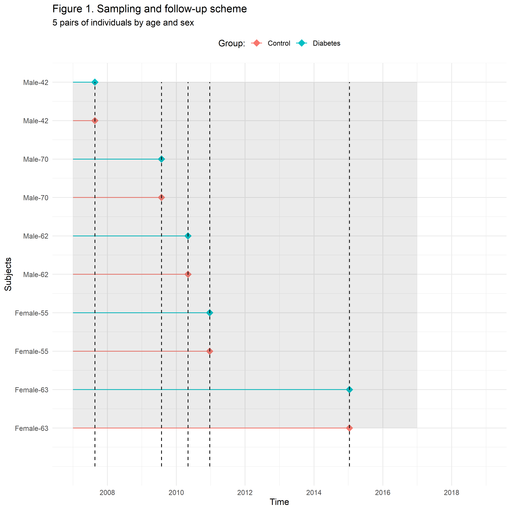
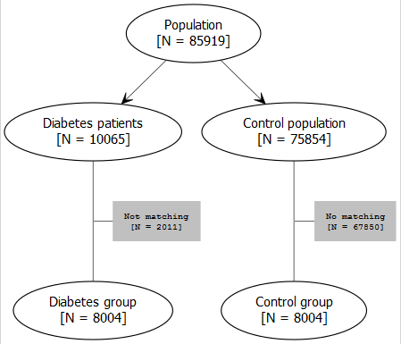
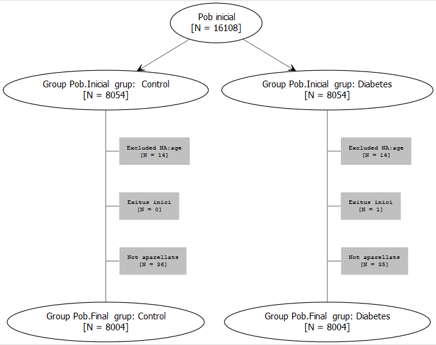

layout: true
background-image: url(logoDAP_Cat.png)
background-position: 95% 0% 
background-size: 30%


```{r setup, include=FALSE}
options(htmltools.dir.version = FALSE)
knitr::opts_chunk$set(echo = FALSE, warning = FALSE, message = F)

library(dplyr)
# source("funcions_TBC.R")

# # CArrego funcions -------------------
# link_source<-paste0("https://github.com/jrealgatius/Stat_codis/blob/master/funcions_propies.R","?raw=T")
# devtools::source_url(link_source)


# "https://www.aspb.cat/wp-content/themes/aspb/images/agencia-salut-publica.png"

# "https://www.idiapjgol.org/images/logo.png"


# xaringan::inf_mr()

```

```{r carregar_dades, include=FALSE}

# dir_output<-"dades/output_dinamic2"
# 
# load(here::here(dir_output,"output4.Rdata"))
# dt_ecap<-netejar.noms.variables(dt_ecap) %>% as_tibble()
# dades<-dt_ecap %>% netejar_espais()

# pagedown::chrome_print("presentacio_xaring.html")

```


---
class: left, middle


Estudio longitudinal retrospectivo de cohortes apareadas en un distrito de Barcelona con una conocida alta incidencia de TB utilizando bases de datos poblacionales (**Real World Data**).

# Guión

* Diseño
* Fuentes de datos
* Criterios de inclusión
* Procedimiento de muestreo
* Análisis
* Limitaciones


---

### Diseño

Logitudinal retrospectivo de cohortes apareadas basado en registros clínicos (**Real World Data**)


### Fuentes de datos


 Fuente   |  Información      |
----------| ---------------------
E-Cap     | Población a riesgo grupos de estudio, características sociodemográficas, y clínicas
ASPB      | Casos de tuberculosis acontecidos durante el seguimiento

--
* Vinculación de registros

--
* Diseño una cohorte retrospectiva abierta. 

--
* Periodo de observación: 01/2007- 12/2018. 

---

## Criterios de inclusión

### Población a Riesgo

Variable   |  Criterio     
-----------|-------------
Edad       | > 18 años    
Área       | Ciutat Vella de Barcelona 
Período    | 01/2007 - 12/2016 
Grupos:     | Diabeticos
           | Controles
--
DM prevalentes (01/2007) + DM incidente durante reclutamiento
--
Selección de controles de igual edad, sexo, en fecha
  
---
class: center,middle
## Procedimiento de muestreo (I)

Método de reclutamiento: densidad de incidencia

 


---
class: center,middle

## Procedimiento de muestreo (II)

Seguimiento de sujetos

 
---

class: center,middle

## Procedimiento de muestreo (III)

### Flow-Chart

.pull-left[
 
]

.pull-right[

 

]

```{r, include=TRUE,eval=FALSE, out.width = "300px"}


# 

```


---

## Análisis 


* Incidencia segun tiempo a riesgo (IC95%). Paquete de R: epiR, método exacto
--

* Hazard ratios no ajustados, ajustados según:
  - Origen, frecuentación, variables clínicas (BMI, PAS/PAD), factores de riesgo (tabaco/alcohol)

--

* Modelo de riesgos competitivos Fine & Grey por clusters. Paquete de R: crrSC (ver 1.1) 

--

* Modelo clusters & Riesgos de cox condicionales. Paquete de R: survival
--

* Análisis de sensibilidad varios modelos 

--

* R version 3.6.3 (2020)

--

* Código abierto disponible en github: https://github.com/jrealgatius/TBC_ANALISIS


---

## Análisis 


---

## Limitaciones / Fortalezas


Limitación                   |  Comentario     
-----------------------------|-------------
Infraregistro de outcome     | Gran base de datos poblacional    
Infraregistro de exposición  | Registro clínico de AP    
Missings en covariables      | Categorización + Cat missing
Sesgo diferencial            | Ajuste por frequentación  
Confusión residual           | Análisis de sensibilidad / Ajuste
Tamaño muestral              | Otras hipótesis


--

